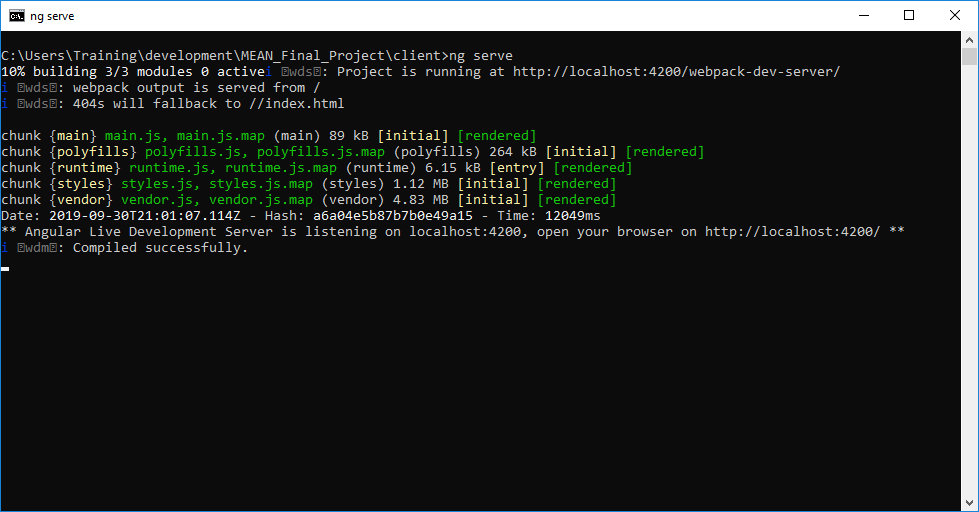
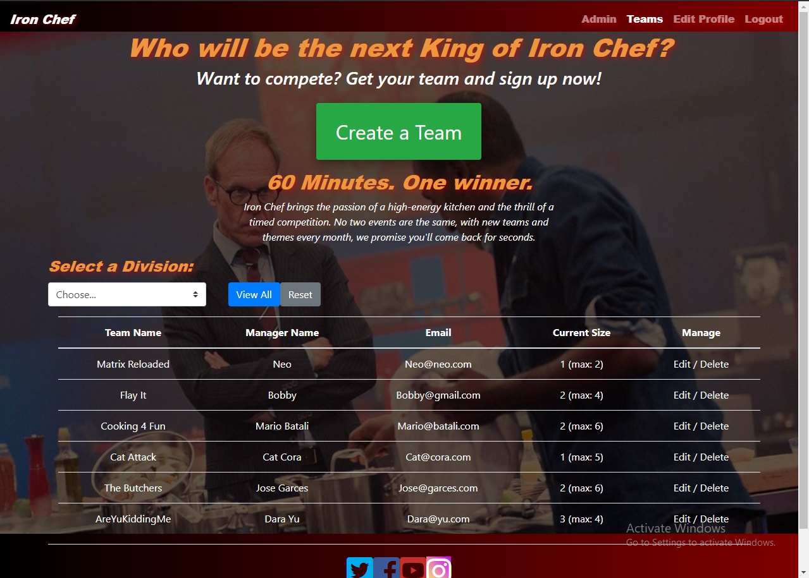

# Client

This project was generated with [Angular CLI](https://github.com/angular/angular-cli) version 8.3.5.
  
## Technologies
 * Bootstrap4
 * REST API
 * Angular

## Setup
Clone / Fork / Download Repo then run 
```
cd client
npm install
```

## Development server

Run `ng serve` for a dev server. Navigate to `http://localhost:4200/`. The app will automatically reload if you change any of the source files.



## Code scaffolding

Run `ng generate component component-name` to generate a new component. You can also use `ng generate directive|pipe|service|class|guard|interface|enum|module`.

### Running unit tests

Run `ng test` to execute the unit tests via [Karma](https://karma-runner.github.io).

### Running end-to-end tests

Run `ng e2e` to execute the end-to-end tests via [Protractor](http://www.protractortest.org/).

### Test App (Browser)

[http://localhost:4200/](http://localhost:4200/)

### Teams View


### Further help

To get more help on the Angular CLI use `ng help` or go check out the [Angular CLI README](https://github.com/angular/angular-cli/blob/master/README.md).

### Acknowledgments

* Robert
* Sara

### Reporting issues
Use [Github's Issues section for this repository](https://github.com/NghiaVu1010/MEAN_Final_Project/issues) to report any issues with the notes.

Examples of the kind of issues that may need reporting:
+ Typos
+ Code samples not working as described
+ Broken or moved links
+ Etc.
